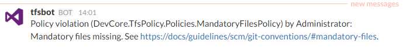

# TfsPolicy

TfsPolicy is a plugin for Team Foundation Server that can deny TFS events based on policies.

This isn't a polished product by any means, more of an example of how these things can be accomplished. 

## Policies

TfsPolicy works by subscribing to TFS events that generate a `DecisionPoint`, which gives us the opportunity to deny the event by returning `EventNotificationStatus.ActionDenied`.

Policies are defined in code under `Policies/`.

The project has two sample policies that reject a Git push if it doesn't follow the guidelines for naming and mandatory files:

* BranchNamingPolicy
* MandatoryFilesPolicy

The pusher will get a message back explaining why the push was rejected:

```
$ git push origin master
Counting objects: 3, done.
Writing objects: 100% (3/3), 218 bytes | 0 bytes/s, done.
Total 3 (delta 0), reused 0 (delta 0)
remote: Analyzing objects... (3/3) (1 ms)
remote: Storing packfile... done (44 ms)
remote: Storing index... done (62 ms)
To http://tfs06:8080/tfs/DefaultCollection/_git/policytest
 ! [remote rejected] master -> master (The reference was rejected by a plugin. Plugin: TfsPolicy with message: Mandatory files missing. See https://docs/guidelines/scm/git-conventions/#mandatory-files.)
error: failed to push some refs to 'http://tfs06:8080/tfs/DefaultCollection/_git/policytest'
```

## Notifications

TfsPolicy will publish a `DevCore.TfsPolicy.PolicyViolationEvent` when a policy violation occurs, so the violation can be picked up by other subscribers. The `TfsPolicy.Notification` project contains a subscriber that integrates with [TfsNotificationRelay](https://github.com/kria/TfsNotificationRelay) to send a notification to Slack etc.



## Usage

* Define your policies under `Policies/` by extending `PolicyBase`.
* Compile.
* Copy `DevCore.TfsPolicy.dll` to *C:\Program Files\Microsoft Team Foundation Server 15.0\Application Tier\Web Services\bin\Plugins*.
* If you want to integrate with TfsNotificationRelay, also copy `DevCore.TfsPolicy.Notification.dll`.
